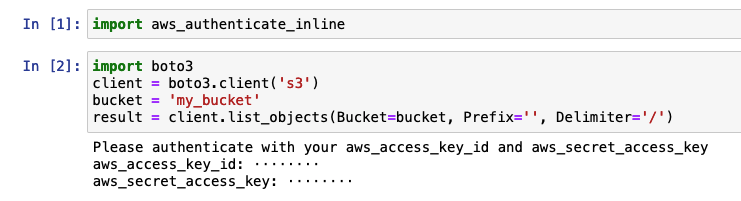

# AWS Authenticate Inline

This module provides a convenient way to authenticate to AWS in a notebooking environment like Jupyter Notebook or Google Colab.

Simply import the module, then proceed as normal with (for example) the `botocore` or `boto3` packages. If `botocore` isn't able to find valid credentials via `~/.aws`, or environment variables, or via the instance's IAM role, then it will prompt you for credentials.

